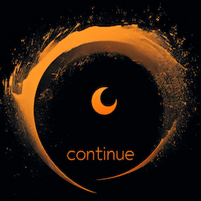

# continue

continue is a Rust implementation of a Swift-style continuation API.

# For those more familiar with Rust

A continuation is a type of single-use channel.  The sender side of the channel sends a value.  The receiver of the channel is a `Future`, that `Output`s said value.  (It is a programmer error to drop a sender before sending).

A common usecase for the continuation type is when you need to implement a custom Future based on being signaled by an external source when the `Future` is complete.

# For those more familiar with Swift

continue is the answer to how to do [`withCheckedContinuation`](https://developer.apple.com/documentation/swift/withcheckedcontinuation(isolation:function:_:)), [`CheckedContinuation`](https://developer.apple.com/documentation/swift/checkedcontinuation), and related APIs when in Rust.

# For those entirely *too* familiar with Rust

You may well ask: why use this?  I can 'simply' write my output into the future's memory, signal the waker, and be done with it.

Not quite.  First, because wakers implicitly have a short lifetime (until the next poll, e.g. you must re-register wakers on each poll), you need some way to
smuggle this value across threads.  The usual hammer for this nail is [`atomic-waker`](https://crates.io/crates/atomic-waker), which it will not surprise you to learn is a dependency.

Secondly Drop is surprisingly hard.  In Rust, the Future side can be dropped early.  In which case: a) are you writing to a sound memory location, b) will you `Drop` the right number of times regardless of how Dropped or in-the-process-of-being-Dropped the future side is,  c) Did you want to run some code on Drop to cancel in-flight tasks, d) Did you want to optimistically poll the cancellation state and how will you smuggle that across, etc.

Thirdly, executors are surprisingly hard.  It would be *sound* for an executor to keep polling you forever after it has a result, is your implementation sound in that case? Across `Drop` and `!Clone` types?

I found myself making too many mistakes, in too many places, and so I've decided to make them all in one place: right here!

